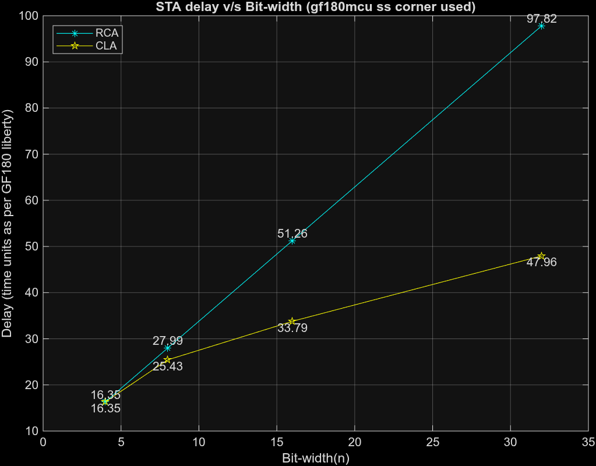
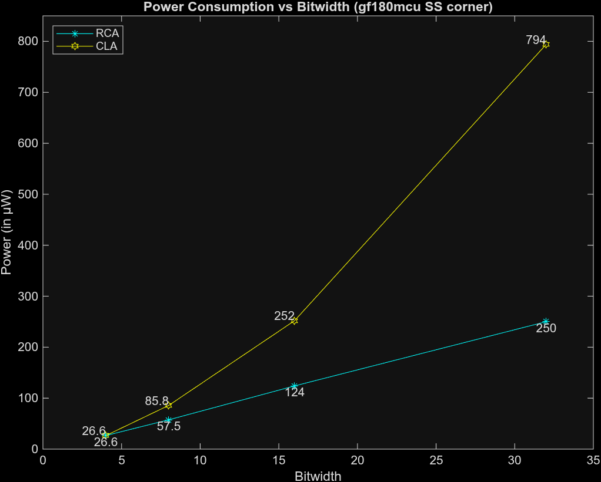
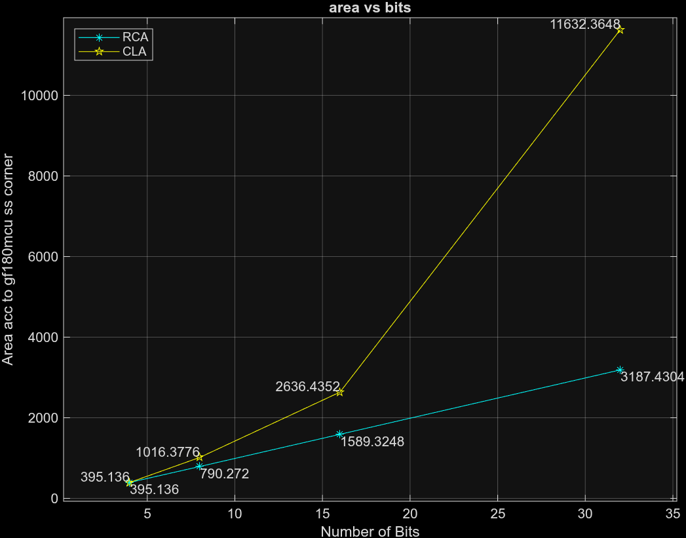

# Adder_Comparisons
Timing comparison of parameterized Carry Lookahead Adder (CLA) and Ripple Carry Adder (RCA) using gate-level STA, with analysis and visualization of delay scaling across bit-widths.

## OVERVIEW
- Parameterized CLA and RCA designs written in Verilog
- Gate-level synthesis and timing analysis
- Delay analysis across multiple bit-widths (4, 8, 16 & 32)
- Visualization os STA results using MATLAB

## REPOSITORY STRUCTURE
- 'rtl/'
  Parameterized Verilog designs of CLA and RCA

- 'yosys/'
  Yosys synthesis scripts used to prepare netlist for STA

- 'sta/'
  TCL scripts for running static timing analysis

- 'analysis/'
  MATLAB script and generated plots for delay comparison

## TOOLS USED
- Verilog HDL
- Yosys
- OpenSTA (for static timing analysis)
- MATLAB

## RESULTS
The following plot shows the gate-level STA DELAY comparison between CLA and RCA across multiple bit-widths

  

The results are consistent with the expected linear delay growth for RCA and sub-linear delay growth for CLA according to their respective carry propagation methods

The following plot shows the power consumption comparison between CLA and RCA across multiple bit-widths

  

The following plot shows the area comparison between CLA and RCA across multiple bit-widths

  

## KEY INSIGHTS
# Area
The super linear growth of the area of CLA from 16 bits to 32 bits is due to the increase in logic complexity and the carry lookahead mechanism. As bitwidth increases, additional propagate and generate logic leads to rapid area expansion
However it's shown that RCA area grows near-linearly which is indicative of its simple design and carry logic. This highlights the tradeoff between speed due to carry propagate logic and the subsequent area expansion due to complex logic in CLA.

# Power
The increase in area is also indicative of higher logic complexity which in turn leads to increased gate and interconnect capacitances and also higher fanout. These factors contribute significantly for the sharp rise in power consumption in CLA after 16 bits. It is observed that here too, RCA power grows near-linearly indicative of its strength in low power applications due to simpler design and smaller area.
Although the gf180mcu SS corner has been used for all analysis (which is not a worst-case power corner), the sharp rise in CLA power consumption is evident. This indicates that the power consumption increase is an inherent to the architecture of the CLA rather than being a result of a particular corner used. 

## NOTES
- The delay time units are units reported from STA which are defined by the standard-cell library used (GlobalFoundries 180 nm Mixed-Signal CMOS (GF180MCU) - SS corner used)

## FUTURE WORK
- Comparison with parallel-prefix adders (e.g Brent-Kung adder)
- Extend timing analysis across different power-voltage-temperature corners

